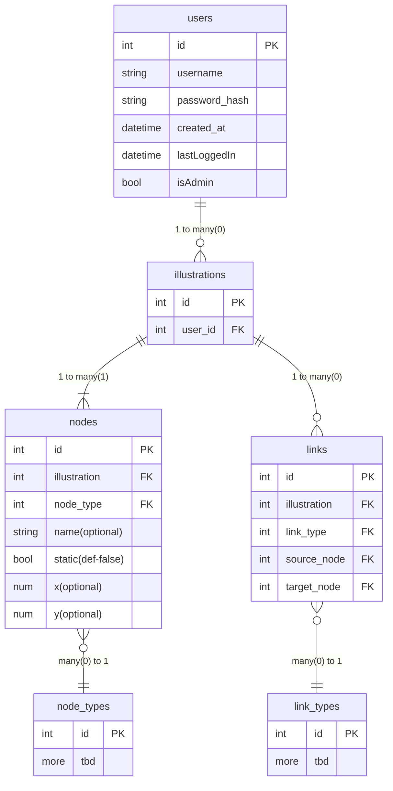

# Database Entity Relationship Diagram 0.1

```mermaid
erDiagram
    users {
        int id PK
        string username
        string password_hash
        datetime created_at
        datetime lastLoggedIn
        bool isAdmin
    }

    illustrations {
        int id PK
        int user_id FK
    }

    nodes {
      int id PK
      int illustration FK
      int node_type FK
      string name(optional)
      bool static(def-false)
      num x(optional)
      num y(optional)
    }

    links {
      int id PK
      int illustration FK
      int link_type FK
      int source_node FK
      int target_node FK
    }

  node_types {
    int id PK
    more tbd
  }

  link_types {
    int id PK
    more tbd
  }

    users ||--o{ illustrations : "1 to many(0)"
    illustrations ||--|{ nodes : "1 to many(1)"
    illustrations ||--o{ links : "1 to many(0)"
    nodes }o--|| node_types : "many(0) to 1"
    links }o--|| link_types : "many(0) to 1"
```
