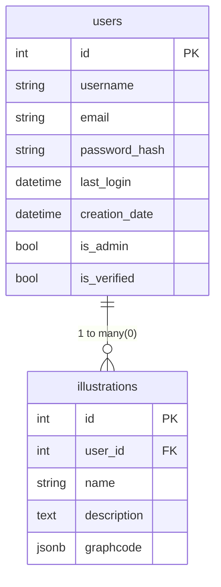

# Database Entity Relationship Diagram 0.2

```mermaid
erDiagram
    users {
        int id PK
        string username
        string email
        string password_hash
        datetime last_login
        datetime creation_date
        bool is_admin
        bool is_verified
    }

    illustrations {
        int id PK
        int user_id FK
        string name
        text description
        jsonb graphcode
    }

    users ||--o{ illustrations : "1 to many(0)"
```
